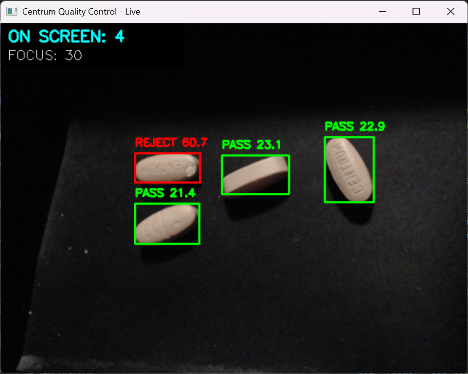

# Capsule Damage Detection System

A high-performance computer vision system designed to detect and classify the physical state of capsules in real-time. Using a hybrid approach of **OpenCV** for localization and **PyTorch** for deep learning inference, the system identifies whether capsules are **damaged**, **scuffed**, or **intact**.

## Demo


---

## Project Pipeline
The system utilizes a staged pipeline to ensure high precision while maintaining low latency:

```text
Camera Frame
      │
      ▼
Grayscale Conversion
      │
      ▼
Thresholding (Otsu)
      │
      ▼
Contour Detection
      │
      ▼
Capsule Cropping
      │
      ▼
Image Preprocessing
      │
      ▼
Deep Learning Classifier
      │
      ▼
Damage / No Damage Prediction
```

---

## The Key Idea: Pre-Inference Cropping
A critical design decision was implementing **Region of Interest (ROI) extraction** before classification. Instead of processing a full 1080p frame, the system isolates each capsule individually.

### Why this works:
* **Higher Accuracy:** Eliminates background noise (table textures, shadows, reflections) that can lead to false positives.
* **Reduced Overhead:** Processing a 224x224 crop is significantly faster than a 1920x1080 frame.
* **Scalability:** Allows the system to process multiple capsules in a single frame by iterating through detected contours.

---

## Hardware & Tech Stack

### Software
* **Python:** Core logic.
* **OpenCV:** Image processing and contour detection.
* **PyTorch & TorchVision:** Deep learning framework and model architecture.
* **NumPy:** Efficient matrix operations.

### Hardware
* **GPU:** NVIDIA RTX 4070 (Optimized for 8GB VRAM).
* **Camera:** Logitech C920 (1080p).
    * *Note: While accessible, lighting and positioning are critical due to limited macro focus.*

---

## How It Works

### 1. Detection & Extraction
The system uses `cv2.findContours` to locate capsules. Small contours are filtered as noise, and valid capsules are cropped with specific padding to ensure the edges are preserved for the classifier.

### 2. Preprocessing
Each crop undergoes a transformation sequence:
* **Resize:** Adjusted to 224x224 pixels.
* **Normalize:** Scaled using ImageNet statistics.
* **Transfer:** Tensors are moved to **CUDA** for hardware acceleration.

### 3. Classification
The neural network evaluates the surface texture and geometry to categorize the capsule as:
* **Intact**
* **Scuffed**
* **Damaged**

---

## Limitations & Future Work

| Current Limitations | Future Improvements |
| :--- | :--- |
| **Lighting Sensitivity:** Shadows can break thresholding. | **YOLO Integration:** Replace contours with object detection. |
| **Overlap:** Touching capsules may be seen as one object. | **Segmentation:** Use Mask R-CNN for overlapping items. |
| **Consumer Hardware:** Webcams lack industrial sharpness. | **Industrial Optics:** Support for macro inspection lenses. |

---

## Getting Started
1. Clone the repo: `git clone https://github.com/your-username/capsule-detection.git`
2. Install dependencies: `pip install -r requirements.txt`
3. Run the inference script: `python src/live_inspector.py`
